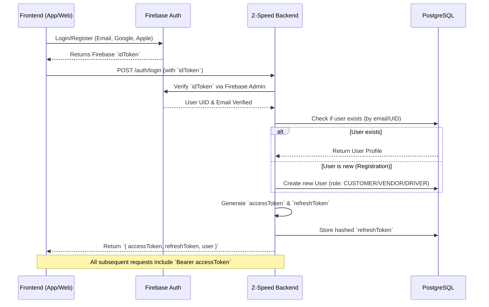
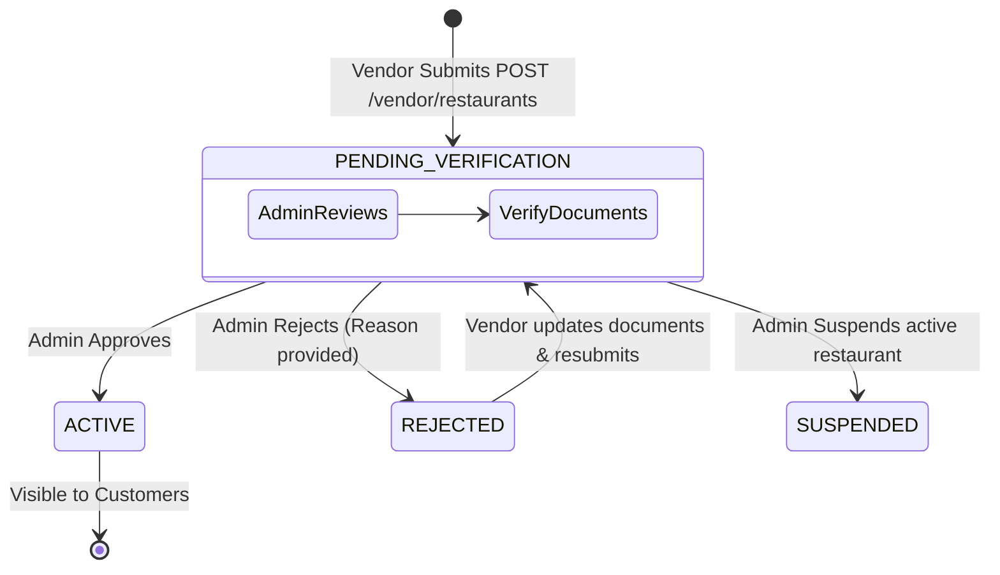
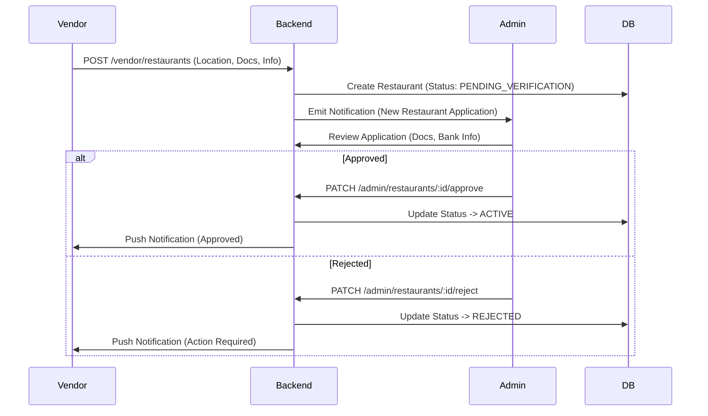
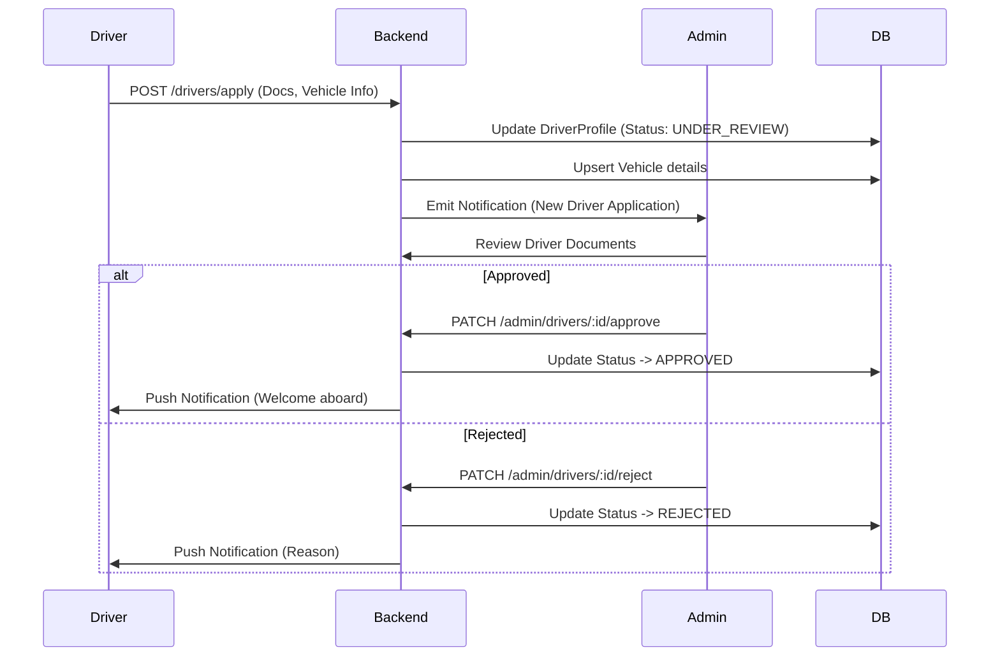
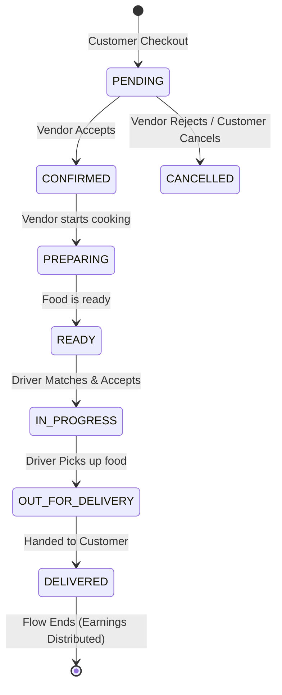
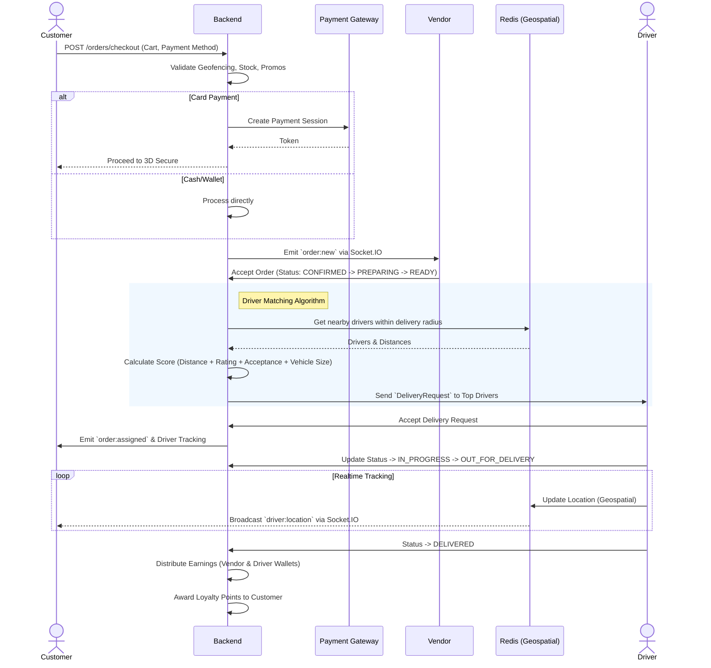
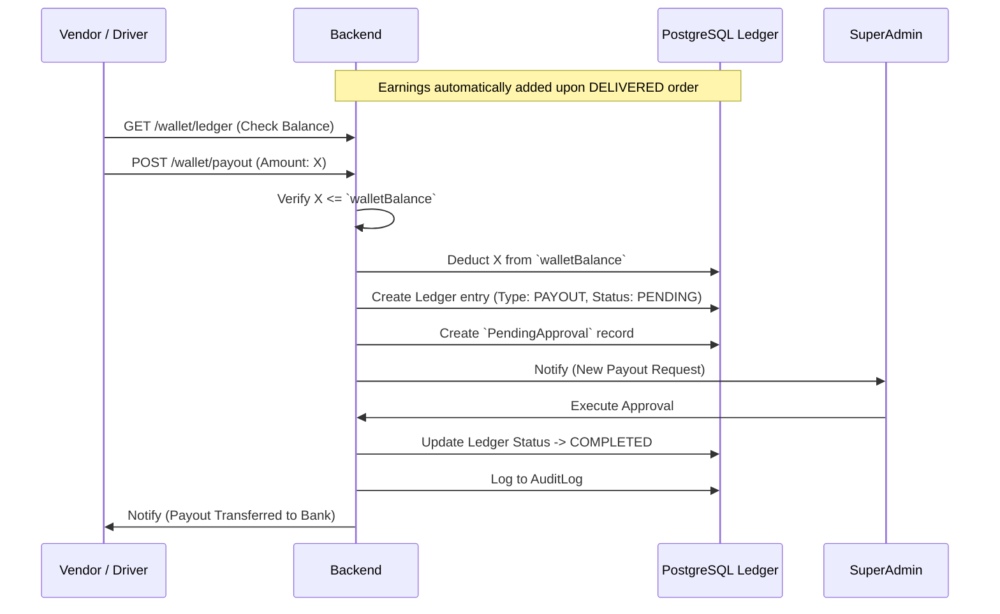

# Z-Speed System Flows & Diagrams 🚀

This document illustrates the complete end-to-end flows for the **Z-Speed** application. We use Mermaid diagrams to provide a visual, structured understanding of the system's architecture, user journeys, and internal processing logic.

---

## 1. Authentication & Onboarding Flow 🔐

This flow explains how users (Customers, Vendors, Drivers) authenticate using Firebase, and how the backend manages secure sessions using JWT.



---

## 2. Restaurant Creation & Approval Flow 🏪

Vendors must apply to create a restaurant. The system ensures an Admin manually verifies documents before the restaurant becomes active on the platform.





---

## 3. Driver Application & Onboarding Flow 🛵

Similar to restaurants, drivers must submit an application containing their National ID, Driver's License, and Vehicle info.



---

## 4. End-to-End Order & Delivery Flow 📦

This is the core flow of the system. It covers cart checkout, payment, vendor preparation, real-time driver matching (scoring algorithm), and delivery.



### Detailed Order Sequence



---

## 5. Wallet & Payout Flow 💰

When a driver or vendor accumulates earnings, they reside in the system's digital wallet. They can request payouts to external banks/wallets.



---

## 6. Realtime Communication Architecture (WebSockets & BullMQ) ⚡

How background jobs (like push notifications) and real-time events (like map tracking) work.

```mermaid
graph TD
    Client[Mobile/Web Client] -->|WebSocket (Socket.IO)| Gateway[Realtime Gateway]
    Gateway -->|Authentication| JWT[JWT Auth Guard]
    
    subgraph Rooms
        Gateway --> C_Room[Customer Room]
        Gateway --> V_Room[Vendor Room]
        Gateway --> D_Room[Driver Room]
        Gateway --> A_Room[Admin Room]
    end
    
    Services[Backend Services] -->|Emit Events| Gateway
    Services -->|Add Jobs| Queue[BullMQ / Redis]
    
    Queue --> Worker1[Notification Processor (FCM)]
    Queue --> Worker2[Email Processor]
    Queue --> Worker3[Stats / Cleanup Processor]
```

### Key Realtime Events
- `order:new` ➔ Sent to Vendor room.
- `order:status_changed` ➔ Sent to Customer room.
- `order:new_request` ➔ Sent to Driver room.
- `driver:location` ➔ Sent to Customer room (Live Tracking).
- `approval:new` ➔ Sent to Admin/SuperAdmin rooms.
