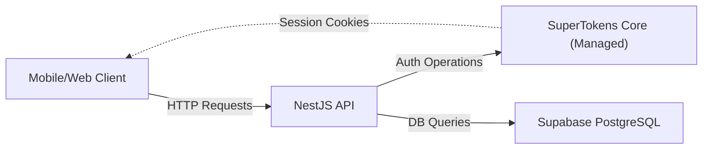
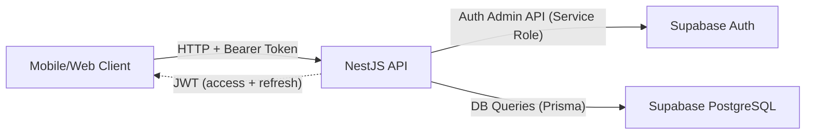

# Auth Migration: SuperTokens → Supabase (Private Backend)

## Goal

Replace SuperTokens SDK with Supabase SDK (`@supabase/supabase-js`) as the identity provider while maintaining the **Private Backend** architecture — the frontend (mobile/web) never communicates with Supabase directly. All auth operations flow through the NestJS API.

## Current Architecture Summary



### Current SuperTokens Touchpoints (13 Files)

| Layer | File | SuperTokens Usage |
|-------|------|-------------------|
| **Core Init** | `auth/supertokens/supertokens.service.ts` | SDK init, recipes config, DB sync overrides |
| **Core Module** | `auth/supertokens/supertokens.module.ts` | NestJS module wrapper |
| **Middleware** | `auth/supertokens/supertokens.middleware.ts` | Express middleware for session handling |
| **Exception Filter** | `auth/supertokens/supertokens-exception.filter.ts` | Error handler for SuperTokens exceptions |
| **Auth Service** | `auth/auth.service.ts` | EmailPassword, ThirdParty, Session recipes |
| **Auth Controller** | `auth/auth.controller.ts` | `SessionRequest` type import |
| **Auth Module** | `auth/auth.module.ts` | SuperTokensModule import |
| **Current User** | `auth/decorators/current-user.decorator.ts` | Session payload extraction |
| **Auth Guard** | `common/guards/supertokens-auth.guard.ts` | `verifySession()` + JWT fallback |
| **Optional Guard** | `common/guards/optional-supertokens-auth.guard.ts` | Optional session verification |
| **Guards Index** | `common/guards/index.ts` | Barrel exports |
| **App Module** | `app.module.ts` | SuperTokensMiddleware registration |
| **Main.ts** | `main.ts` | CORS headers, exception filter |

### Controllers Using SuperTokensAuthGuard (7 files)
- `auth/auth.controller.ts`
- `users/users.controller.ts`
- `orders/orders.controller.ts`
- `restaurants/restaurants.controller.ts`
- `reviews/reviews.controller.ts`
- `loyalty/loyalty.controller.ts`
- `upload/upload.controller.ts`
- `cart/cart.controller.ts`
- `drivers/drivers.controller.ts`

---

## New Architecture



> [!IMPORTANT]
> **Private Backend Strategy**: Supabase `SUPABASE_URL` and `SERVICE_ROLE_KEY` are **server-side only**. The frontend receives standard JWT tokens from our API and never sees Supabase credentials.

---

## Open Questions

> [!IMPORTANT]
> ### 1. Supabase Project Credentials
> I need the following values to configure `supabaseClient.ts`. These should be from your **existing Supabase project** (the one already used for PostgreSQL at `ddfzbiljafithtaztlhi`):
> - `SUPABASE_URL` — e.g., `https://ddfzbiljafithtaztlhi.supabase.co`
> - `SUPABASE_SERVICE_ROLE_KEY` — found in Supabase Dashboard → Settings → API → `service_role` key
> - `SUPABASE_JWT_SECRET` — found in Supabase Dashboard → Settings → API → JWT Secret (used to verify tokens server-side)
>
> **I will add placeholders in `.env` — you must fill them before testing.**

> [!WARNING]
> ### 2. Existing Users Migration
> There are existing users with `supertokensId` in the database. After migration:
> - New users will get a Supabase `auth.users.id` (UUID) stored in a new `supabaseId` field
> - The `supertokensId` field will be kept temporarily for backward compatibility but marked as deprecated
> - **Do you want a one-time migration script to move existing users to Supabase Auth, or are you OK with existing users re-registering?**

> [!IMPORTANT]
> ### 3. Token Delivery Strategy
> Currently SuperTokens uses **cookies** for session management. The new system will use **Bearer tokens** (JSON response body). The frontend mobile/web apps should:
> - Store `accessToken` and `refreshToken` from login response
> - Send `Authorization: Bearer <accessToken>` on every request
> - Call `POST /api/v1/auth/refresh` when token expires
> 
> **This matches what the debug/dev mode already does, so mobile apps using JWT mode will work without changes.**

---

## Proposed Changes

### Phase 1: Dependencies & Configuration

#### [NEW] Install Supabase SDK
```bash
npm install @supabase/supabase-js
```

#### [NEW] [supabaseClient.ts](file:///home/omar/Desktop/Z-SPEED/BACKEND/src/common/supabase/supabaseClient.ts)
New file — creates a Supabase admin client using `SERVICE_ROLE_KEY` (server-side only).

```typescript
// Creates two clients:
// 1. supabaseAdmin — uses SERVICE_ROLE_KEY for admin operations (createUser, deleteUser, etc.)
// 2. Helper to create per-request clients with user's access token (for RLS if needed)
```

#### [NEW] [supabase.module.ts](file:///home/omar/Desktop/Z-SPEED/BACKEND/src/common/supabase/supabase.module.ts)
NestJS module that provides `SupabaseService` as a global injectable.

#### [MODIFY] [.env](file:///home/omar/Desktop/Z-SPEED/BACKEND/.env)
- Add: `SUPABASE_URL`, `SUPABASE_SERVICE_ROLE_KEY`, `SUPABASE_JWT_SECRET`
- Remove: `SUPERTOKENS_CONNECTION_URI`, `SUPERTOKENS_API_KEY`

---

### Phase 2: Auth Service Rewrite

#### [MODIFY] [auth.service.ts](file:///home/omar/Desktop/Z-SPEED/BACKEND/src/auth/auth.service.ts)
Complete rewrite of auth logic — **this is the main file**.

| Method | Before (SuperTokens) | After (Supabase) |
|--------|----------------------|-------------------|
| `emailRegister()` | `EmailPassword.signUp()` + `Session.createNewSession()` | `supabase.auth.admin.createUser()` + JWT sign |
| `emailLogin()` | `EmailPassword.signIn()` + `Session.createNewSession()` | `supabase.auth.signInWithPassword()` → returns Supabase session |
| `socialSignIn()` | `ThirdParty.manuallyCreateOrUpdateUser()` + `Session.createNewSession()` | Verify provider token → `supabase.auth.admin.createUser()` or lookup existing → JWT sign |
| `logout()` | `req.session.revokeSession()` | `supabase.auth.admin.signOut(userId)` + blacklist token in Redis |
| `forgotPassword()` | `EmailPassword.sendEmail()` | `supabase.auth.resetPasswordForEmail()` |
| `refreshSession()` | SuperTokens middleware auto-refresh | `supabase.auth.refreshSession(refreshToken)` |

**Key Design Decisions:**
1. **Email/Password Register**: Use `supabase.auth.admin.createUser()` with `email_confirm: true` (since we handle verification ourselves via OTP)
2. **Email/Password Login**: Use `supabase.auth.signInWithPassword()` which returns `access_token` and `refresh_token`
3. **Social Auth**: We continue verifying tokens ourselves (Google/Apple libraries), then create/link the user in Supabase using admin API
4. **Response Format**: Returns `{ accessToken, refreshToken, user }` — same shape as current dev mode responses

#### [NEW] Refresh Token Endpoint
New endpoint `POST /api/v1/auth/refresh` that accepts a `refreshToken` in the body and returns a new `accessToken` + `refreshToken` pair.

---

### Phase 3: Guards & Middleware Migration

#### [MODIFY] [supertokens-auth.guard.ts](file:///home/omar/Desktop/Z-SPEED/BACKEND/src/common/guards/supertokens-auth.guard.ts) → Rename to `auth.guard.ts`

**Before**: Tries `verifySession()` from SuperTokens, falls back to manual JWT.
**After**: Pure JWT verification using `@nestjs/jwt` `JwtService.verify()` with `SUPABASE_JWT_SECRET`. No SuperTokens dependency.

The guard will:
1. Extract `Bearer <token>` from `Authorization` header
2. Verify JWT signature using `SUPABASE_JWT_SECRET` or our own `JWT_SECRET`
3. Decode payload → extract `sub` (Supabase user ID), look up `dbUserId` and `role`
4. Inject `{ dbUserId, role, supabaseId }` into `request.user`

#### [MODIFY] [optional-supertokens-auth.guard.ts](file:///home/omar/Desktop/Z-SPEED/BACKEND/src/common/guards/optional-supertokens-auth.guard.ts) → Rename to `optional-auth.guard.ts`

Same as above, but doesn't throw on missing/invalid token — sets `request.user = null`.

#### [MODIFY] [current-user.decorator.ts](file:///home/omar/Desktop/Z-SPEED/BACKEND/src/auth/decorators/current-user.decorator.ts)

Remove `SessionRequest` import. Extract user data from `request.user` (set by the guard) instead of `request.session.getAccessTokenPayload()`.

#### [DELETE] [supertokens.middleware.ts](file:///home/omar/Desktop/Z-SPEED/BACKEND/src/auth/supertokens/supertokens.middleware.ts)
No longer needed — we don't need SuperTokens middleware processing all routes.

#### [DELETE] [supertokens-exception.filter.ts](file:///home/omar/Desktop/Z-SPEED/BACKEND/src/auth/supertokens/supertokens-exception.filter.ts)
No longer needed — SuperTokens errors won't occur.

---

### Phase 4: Module Wiring

#### [MODIFY] [auth.module.ts](file:///home/omar/Desktop/Z-SPEED/BACKEND/src/auth/auth.module.ts)
- Remove: `SuperTokensModule` import
- Add: `SupabaseModule` import

#### [DELETE] [supertokens.service.ts](file:///home/omar/Desktop/Z-SPEED/BACKEND/src/auth/supertokens/supertokens.service.ts)
#### [DELETE] [supertokens.module.ts](file:///home/omar/Desktop/Z-SPEED/BACKEND/src/auth/supertokens/supertokens.module.ts)

#### [MODIFY] [app.module.ts](file:///home/omar/Desktop/Z-SPEED/BACKEND/src/app.module.ts)
- Remove: `SuperTokensMiddleware` import and `configure()` method registration
- Import `SupabaseModule` globally (so other modules can use it)

#### [MODIFY] [main.ts](file:///home/omar/Desktop/Z-SPEED/BACKEND/src/main.ts)
- Remove: `import supertokens from 'supertokens-node'`
- Remove: `supertokens.getAllCORSHeaders()` from CORS config
- Remove: `SupertokensExceptionFilter` from global filters

---

### Phase 5: Controller Updates (Import Renames)

All controllers that import `SuperTokensAuthGuard` will be updated to import the new `AuthGuard`:

| Controller | Change |
|------------|--------|
| `auth/auth.controller.ts` | `SuperTokensAuthGuard` → `AuthGuard` |
| `users/users.controller.ts` | `SuperTokensAuthGuard` → `AuthGuard` |
| `orders/orders.controller.ts` | `SuperTokensAuthGuard` → `AuthGuard` |
| `restaurants/restaurants.controller.ts` | Both guards renamed |
| `reviews/reviews.controller.ts` | `SuperTokensAuthGuard` → `AuthGuard` |
| `loyalty/loyalty.controller.ts` | `SuperTokensAuthGuard` → `AuthGuard` |
| `upload/upload.controller.ts` | `SuperTokensAuthGuard` → `AuthGuard` |
| `cart/cart.controller.ts` | `SuperTokensAuthGuard` → `AuthGuard` |
| `drivers/drivers.controller.ts` | `SuperTokensAuthGuard` → `AuthGuard` |

---

### Phase 6: Schema Update

#### [MODIFY] [schema.prisma](file:///home/omar/Desktop/Z-SPEED/BACKEND/prisma/schema.prisma)

```diff
 model User {
   id String @id @default(uuid())

-  // ── SuperTokens Auth (Primary) ──────────────────────────
-  supertokensId String? @unique // SuperTokens user ID
+  // ── Supabase Auth (Primary) ──────────────────────────
+  supabaseId    String? @unique // Supabase auth.users.id
+  supertokensId String? @unique // @deprecated — legacy SuperTokens ID, kept for migration
   authProvider  String  @default("email") // email | google | apple | phone
```

> [!NOTE]
> The `supertokensId` field is **kept** temporarily so existing data isn't lost. A future migration can remove it after confirming all users have been migrated.

---

### Phase 7: Cleanup & Security

#### [DELETE] Dependencies from `package.json`
- `supertokens-node` 

#### Remove SuperTokens directory entirely
- Delete: `src/auth/supertokens/` (4 files)

#### [MODIFY] [.env.example](file:///home/omar/Desktop/Z-SPEED/BACKEND/.env.example)
Update with new Supabase variables, remove SuperTokens variables.

#### Security Audit
- ✅ `SERVICE_ROLE_KEY` never exposed to frontend
- ✅ `SUPABASE_JWT_SECRET` only used server-side for token verification
- ✅ No Supabase URL or credentials in client responses
- ✅ Tokens returned as JSON in response body (not stored in server-side state)

---

## File Summary

| Action | File | Description |
|--------|------|-------------|
| 🆕 NEW | `src/common/supabase/supabaseClient.ts` | Supabase admin client singleton |
| 🆕 NEW | `src/common/supabase/supabase.module.ts` | NestJS module for DI |
| 🆕 NEW | `src/common/supabase/supabase.service.ts` | Injectable service wrapping Supabase client |
| ✏️ MODIFY | `src/auth/auth.service.ts` | Full rewrite — SuperTokens → Supabase logic |
| ✏️ MODIFY | `src/auth/auth.controller.ts` | Remove SessionRequest, add refresh endpoint |
| ✏️ MODIFY | `src/auth/auth.module.ts` | Swap SuperTokensModule → SupabaseModule |
| ✏️ MODIFY | `src/auth/decorators/current-user.decorator.ts` | Use `request.user` instead of session |
| ✏️ MODIFY | `src/common/guards/supertokens-auth.guard.ts` → `auth.guard.ts` | Pure JWT verification |
| ✏️ MODIFY | `src/common/guards/optional-supertokens-auth.guard.ts` → `optional-auth.guard.ts` | Pure JWT, optional |
| ✏️ MODIFY | `src/common/guards/index.ts` | Update exports |
| ✏️ MODIFY | `src/app.module.ts` | Remove middleware, add SupabaseModule |
| ✏️ MODIFY | `src/main.ts` | Remove SuperTokens CORS/filters |
| ✏️ MODIFY | `prisma/schema.prisma` | Add `supabaseId`, keep `supertokensId` |
| ✏️ MODIFY | `.env` | New Supabase vars, remove SuperTokens vars |
| ✏️ MODIFY | 9 controllers | Rename guard imports |
| 🗑️ DELETE | `src/auth/supertokens/supertokens.service.ts` | SuperTokens init logic |
| 🗑️ DELETE | `src/auth/supertokens/supertokens.module.ts` | SuperTokens module |
| 🗑️ DELETE | `src/auth/supertokens/supertokens.middleware.ts` | SuperTokens middleware |
| 🗑️ DELETE | `src/auth/supertokens/supertokens-exception.filter.ts` | SuperTokens error handler |
| 🗑️ DELETE | `package.json` dependency: `supertokens-node` | Remove SDK |

---

## Verification Plan

### Automated Tests
```bash
# 1. Build verification — ensures no TypeScript errors
npm run build

# 2. Start the server and verify it boots without errors
npm run start:dev
```

### Manual API Tests (via browser subagent or curl)
1. **Register**: `POST /api/v1/auth/email/register` → expect `accessToken` + user
2. **Login**: `POST /api/v1/auth/email/login` → expect `accessToken` + `refreshToken`
3. **Profile**: `GET /api/v1/auth/profile` with `Authorization: Bearer <token>` → expect user data
4. **Refresh**: `POST /api/v1/auth/refresh` with `refreshToken` → expect new tokens
5. **Social**: `POST /api/v1/auth/social/google` with Google ID token → expect session
6. **Logout**: `POST /api/v1/auth/logout` → expect success

### Security Verification
- Verify `.env` doesn't contain SuperTokens references
- Verify no SuperTokens imports remain in the codebase
- Verify `SERVICE_ROLE_KEY` is not exposed in any API response
- `grep -r "supertokens" src/` should return 0 results
